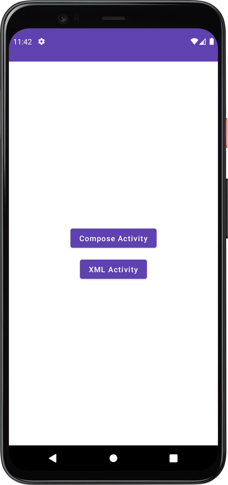
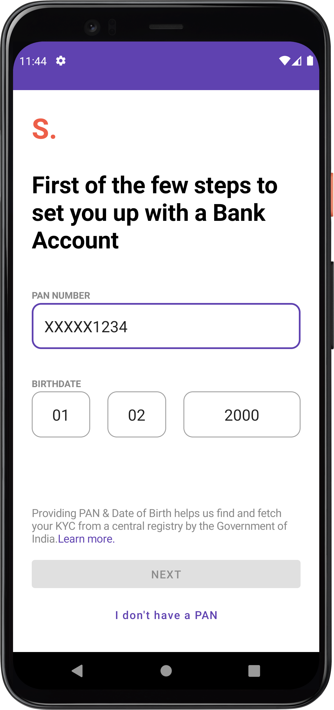
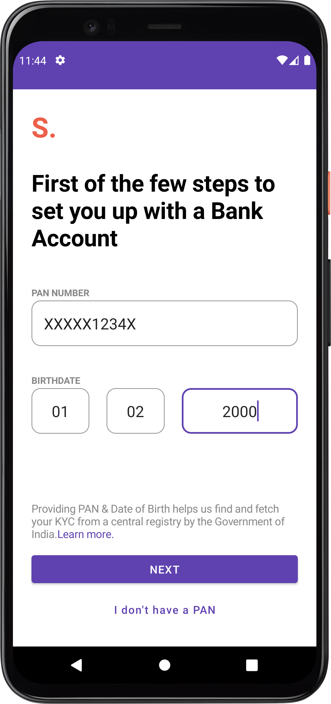
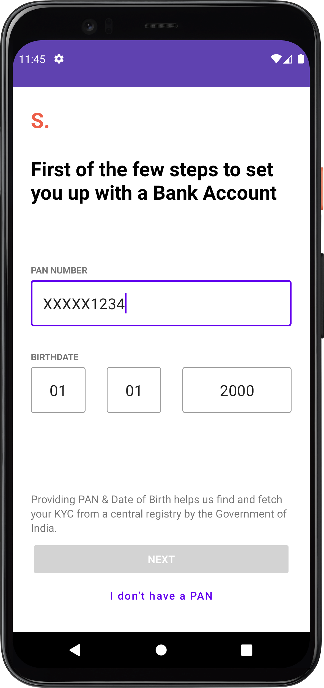
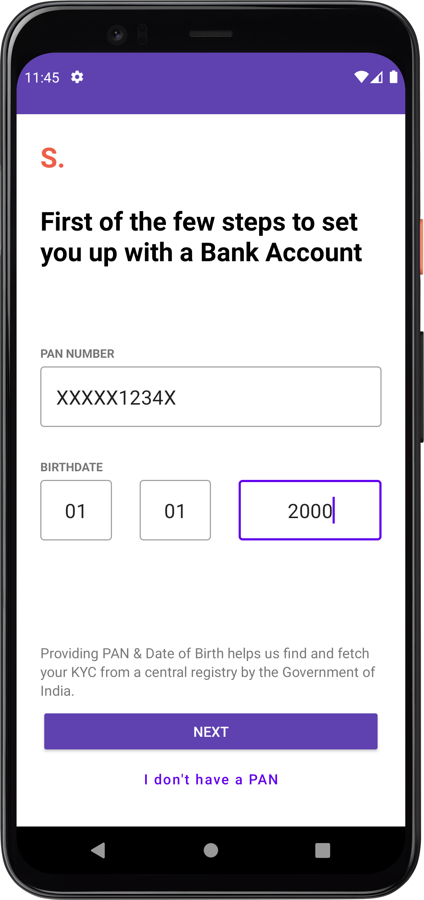

# EpiFi

Dummy UI development for practice.

This UI has been developed to practice Jetpack Compose and XML with Data Binding. 
On app  launch, user has option to visit screen developed in Compose or Xml

Technologies Used:
1. Jetpack Compose
2. Kotlin Coroutines
3. Kotlin Flows
4. Data Binding

### Landing Page 

### Page Developed in Compose
 

### Page Developed in XML
 
